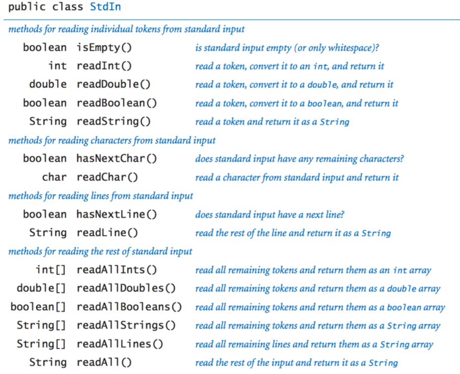

# Project 0

- 根号 (使用 Math class)

    ```java
    public double calcDistance(Planet p) {
        double deltaX = p.xxPos - this.xxPos;
        double deltaY = p.yyPos - this.yyPos;
        return (Math.sqrt(deltaX * deltaX + deltaY * deltaY));
    }
    ```

- 使用 equals() method

    ```java
    public double calcNetForceExertedByX(Planet[] pArray) {
        double netForceX = 0;
        for (Planet p : pArray) {
            if (p.equals(this))     // 使用了 equals() method, 当两个 planet 一致的时候, 返回 true
                continue;
            netForceX += this.calcForceExertedByX(p);
        }
        return netForceX;
    }
    ```

- 读取文件 (使用 In Class)

    ```java
    public static double readRadius(String fileName) {
        In in = new In(fileName);
        in.readInt();
        return in.readDouble();
    }
    ```

    

---

## Input and Output in Java

> Reference: https://introcs.cs.princeton.edu/java/15inout/

### 1 Standard Output

- method signatures

    ```
    void print(String s)
    void println(string s)
    void println()
    void printf(String format, ...)
    ```

- 两个参数的 `printf()`. 示例

    

    更多 format strings

    

- 对于多个参数的 `printf()`，format strings 给每个附加的参数提供一个附加的转换规范

### 2 Standard input

- methods

    

- 示例

    

### 3 Redirection and Piping (重定向和管道)

- 输出重定向示例

    

- 输入重定向示例

    

- 连接两个程序 (将这种机制称为 piping)

    

### 4 Standard drawing

- 绘图的基本命令 (class [`StdDraw`](./source/StdDraw.java))

    ```
    void line(double x0, double y0, double x1, double y1)
    void point(double x, double y)
    ```

    - 默认的坐标比例为一个单位正方形 (所有的 x, y 都介于 0 到 1)

- 控制命令

    

    - 默认的画布大小为 512-by-512

