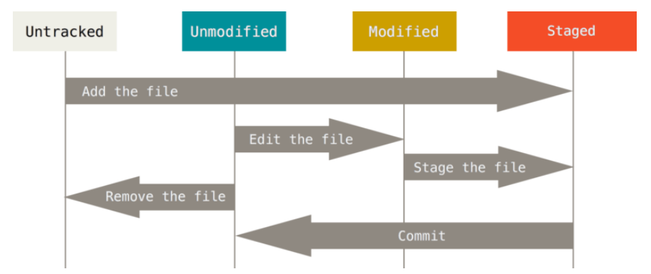

# Using Git Guide

## B Local Repositories (Narrative Introduction)

- 先创建一些食谱

    ```shell
    mkdir recipes
    cd recipes
    mkdir seitan	# 面筋
    mkdir tofu		# 豆腐
    
    cd setan
    vim smoky.txt
    vim boiled.txt
    
    cd ../tofu
    vim kung.txt
    vim basil.txt
    ```

- 初始化

    ```shell
    git init
    ```

- 首先 add 

    ```shell
    git add ./tofu/kung.txt
    ```

- 查看此时状态

    ```shell
    git status
    ```

    得到的结果

    ```shell
    $ git status
    On branch master
    Your branch is up to date with 'origin/master'.
    
    Changes to be committed:
      (use "git restore --staged <file>..." to unstage)
            new file:   tofu/kung.txt
    
    Untracked files:
      (use "git add <file>..." to include in what will be committed)
            seitan/
            tofu/basil.txt
    ```

- commit

    ```shell
    git add ./tofu/basil.txt
    git status	# 观察一下
    git commit -m 'added tofu recipes'
    ```

    - `-m` 参数可以让提交时添加一条信息（可以寄住此次提交最重要的内容）

    - commit 仅保护那些被 add 的文件（而不是所有文件）

    - 此时 `git status`，有

        ```shell
        $ git status
        On branch master
        Your branch is ahead of 'origin/master' by 1 commit.
          (use "git push" to publish your local commits)
        
        Untracked files:
          (use "git add <file>..." to include in what will be committed)
                seitan/
                
        nothing added to commit but untracked files present (use "git add" to track)
        ```

- 使用 `git log`

    ```shell
    $ git log
    commit e149feb431d1161af6e6e77cf036d397d44bcf01 (HEAD -> master)
    Author: Tadori-izanai <u17814@outlook.com>
    Date:   Fri Mar 4 13:43:00 2022 +0800
    
        added tofu recipes
    ```

    其中提交的 id 即为 `e149feb431d1161af6e6e77cf036d397d44bcf01`。可以用 `git show` 查看其

    ```shell
    $ git show e149feb431d1161af6e6e77cf036d397d44bcf01
    commit e149feb431d1161af6e6e77cf036d397d44bcf01 (HEAD -> master)
    Author: Tadori-izanai <u17814@outlook.com>
    Date:   Fri Mar 4 13:43:00 2022 +0800
    
        added tofu recipes
    
    diff --git a/lab/lab1/recipes/tofu/basil.txt b/lab/lab1/recipes/tofu/basil.txt
    new file mode 100644
    index 0000000..9b8034a
    --- /dev/null
    +++ b/lab/lab1/recipes/tofu/basil.txt
    @@ -0,0 +1,3 @@
    +This is a recipe
    +of basil tofu
    +
    diff --git a/lab/lab1/recipes/tofu/kung.txt b/lab/lab1/recipes/tofu/kung.txt
    new file mode 100644
    index 0000000..f61967a
    --- /dev/null
    +++ b/lab/lab1/recipes/tofu/kung.txt
    @@ -0,0 +1,3 @@
    +This is a recipe
    +of kung tofu
    +
    ```

- 现在来更改一个已经 add 过的文件，再使用 `git status` 查看其

    ```shell
    $ vim tofu/kung.txt
    $ git status
    On branch master
    Changes not staged for commit:
      (use "git add <file>..." to update what will be committed)
      (use "git restore <file>..." to discard changes in working directory)
            modified:   tofu/kung.txt
    
    Untracked files:
      (use "git add <file>..." to include in what will be committed)
            seitan/
    ```

    - 此时直接 commit 将会没有任何效果

    - 需要再次 add 再 commit

        ```shell
        $ git add ./tofu/kung.txt
        $ git commit -m 'modify kung'
        ```

- 使用 `checkout` 来进行回滚操作

    ```shell
    git log		# 首先查看要回滚的版本的 id
    git checkout e149feb431d1161af6e6e77cf036d397d44bcf01
    ```

    - 可以 cat 建议一下

        ```shell
        cat tofu/kung.txt
        ```

- 回滚到之后的版本

    ```shell
    git reflog
    git reset --hard <version-number>
    ```

---

<br />

## C Local Reposirories (Technical Overview)

### 1 Tracked vs. Untracked Files



- Untracked files: Git 不维护其 （包括从未 add 的文件和从 tracked files 中被 removed 的文件）
- Tracked files: 已添加到 Git Repository 中的文件 (包括了 Unmodified, modified, staged)

---

### 2 Undoing Changes

- Unatge (取消暂存) 一个没有 commit 的文件 (上图中 Staged -> Modified)

    ```shell\
    git reset HEAD [file]
    ```

    示例

    ```shell
    $ git status
    HEAD detached at e149feb
    Changes to be committed:
      (use "git restore --staged <file>..." to unstage)
            modified:   tofu/kung.txt
    
    Changes not staged for commit:
      (use "git add <file>..." to update what will be committed)
      (use "git restore <file>..." to discard changes in working directory)
            modified:   ../../lab1b/settingUp.md
    
    Untracked files:
      (use "git add <file>..." to include in what will be committed)
            seitan/
            ../usingGit.assets/
            ../usingGit.md
    
    $ git reset HEAD tofu/kung.txt
    $ git status
    HEAD detached at e149feb
    Changes not staged for commit:
      (use "git add <file>..." to update what will be committed)
      (use "git restore <file>..." to discard changes in working directory)
            modified:   tofu/kung.txt
            modified:   ../../lab1b/settingUp.md
    
    Untracked files:
      (use "git add <file>..." to include in what will be committed)
            seitan/
            ../usingGit.assets/
            ../usingGit.md
    
    no changes added to commit (use "git add" and/or "git commit -a")
    ```

- 修改 (amend) 最近一次 commit (修改提交消息或添加忘记添加的文件)

    ```shell
    git add [the-forgotten-file]
    git commit --amend
    ```

- 将文件恢复 (Revert) 到最近一次提交的状态

    ```shell
    git checkout -- [file]
    ```


---

<br />

## D Remote Repositories

- 将我们的 recipes 推送到另一台计算机

    ```shell
    git push origin master
    ```

    - 直接这样写则得到报错信息

        ```shell
        fatal: 'origin' does not appear to be a git repository
        fatal: Could not read from remote repository.
        
        Please make sure you have the correct access rights and the repository exists.
        ```

- `git clone [remote-repo-URL]`
    - 拷贝指定的仓库到本计算机上
    - 并创建一个工作目录（文件排列与下载库中的最新 snapshot 相同）
    - 并记录了远程仓库的 URL，给其一个名称 `origin`
- `git remote add [remote-repo-name] [remote-repo-URL]`
    - 给远程仓库 URL 命名（记录网络数据传输的新位置）
- `git remote -v`
    - 列出网络数据传输的所有位置
- `git pull [remote-repo-name] master`
- `git push [remote-repo-name] master`

---

<br />


