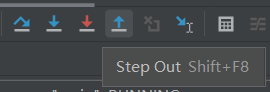
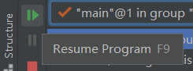

## Debugging

### Step into


### Step Over and Step Out




- Step Over 允许我们在不显示函数执行的情况下完成函数调用
- Step out 直接跳出当前的 function (method)

### Resume



- 一直运行，直道运行到下一个断点处（或结束）

### Conditional breakpoints


- 右键断点，设置条件，可以快速跳转到想要的地方

---

## 其他

- 用于方便地创建 IntList 的 method

    ```java
    public static IntList of(Integer... args) {
        IntList result, p;
    
        if (args.length > 0) {
            result = new IntList(args[0], null);
        } else {
            return null;
        }
    
        int k;
        for (k = 1, p = result; k < args.length; k += 1, p = p.rest) {
            p.rest = new IntList(args[k], null);
        }
        return result;
    }
    ```

    使用此 method 创建 IntList 的方式

    ```java
    IntList myList = IntList.of(0, 1, 2, 3);
    // Creates the IntList 0 -> 1 -> 2 -> 3 -> null
    ```

- 示例：

    ```java
    /**
     * Returns a list equal to L with all elements squared. Non-destructive.
     */
    public static IntList squareListIterative(IntList L) {
        if (L == null) {
            return null;
        }
        IntList res = new IntList(L.first * L.first, null);
        IntList ptr = res;
        L = L.rest;
        while (L != null) {
            ptr.rest = new IntList(L.first * L.first, null);
            L = L.rest;
            ptr = ptr.rest;
        }
        return res;
    }
    ```

    

