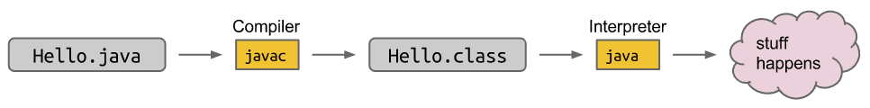

## Introduction to Java

### 1.1 Essentials

1. Hello world

    ```java
    public class HelloWorld {
        public static void main(String[] args) {
            System.out.println("Hello world!");
        }
    }
    ```

    - 使用关键字 `public class` 来类声明
    - Java 中所有代码写在 class 中
    - 运行的代码在 `mian` 方法中
    - Statement 必须以分号结束

2. Java 程序的运行步骤



- Java 编译器 javac

- Java 解释器 java

- 终端命令

    ```shell
    $ javac HelloWorld.java
    $ java HelloWorld
    ```

3. **(Static Typing)** Java 中所有变量都有 **static type**

    - Java 编译器会执行 static type check

    - 一个变量的类型不可改变，例如

        ```java
        int x = 0;
        x = "horse";	// 报错（运行之前编译器就拒绝了这个程序）
        ```

    - Java 是 strongly typed

        ```java
        String h = 5 + "horse";	// 成功, 因为 Java 可以将数字和字符串拼接为一个字符串
        int h = 5 + "horse";	// 给编译错误
        System.out.println(5 + "10");	// 输出 510
        System.out.println(5 + 10);		// 输出 15
        ```

    > Python 中 `5 + "horse"` 会报错，因为无法确定其是数字还是 String

4. **(Function)** 因为 Java 代码都是类的一部分，所以必须定义 function（method）

    ```java
    // 定义一个函数, 示例
    public static int larger(int x, int y) {
        if (x > y)
            return x;
        return y;
    }
    ```

5. Features of good coding style (See [style guide](style-guide.md))

    - Consistent style (Spacing, naming, brace style)
    - Size (lind width 不宽, source file length 不长)
    - Descriptive naming
    - Avoidance of repetitive code
    - Comments

    > Golden Rule: 写容易让 stranger 理解的代码。
    >
    > 可以承担轻微的性能损失，为了更易于理解

6. Through experience and exposure to others' code, you will get a feeling for when comments are most appropriate.

    - 所有 methods 和几乎所有 classes 应使用 Javadoc 格式来注释

    - 示例 without tags

        ```java
        public class LargerDemo {
            /** Returns the large of x and y. */
            public static int larger(int x, int y) {
                if (x > y)
                    return x;
                return y;
            }
            public static void main(String[] args) {
                System.out.println(larger(8, 10));
                ';lkjhg
            }
        }
        ```

    - 详见 [Javadoc.md](javadoc.md)

    

    


