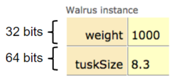
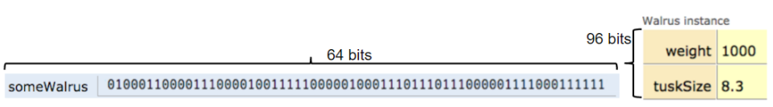
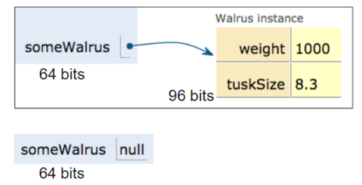
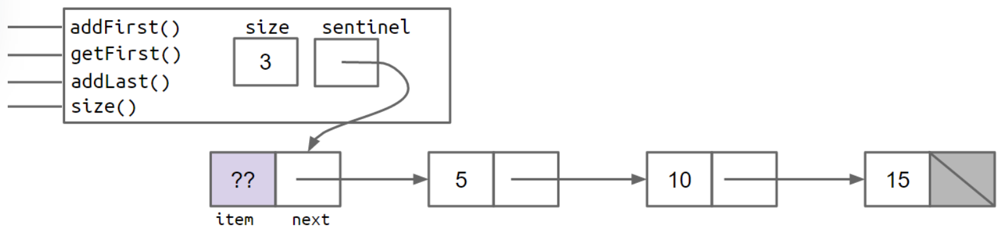
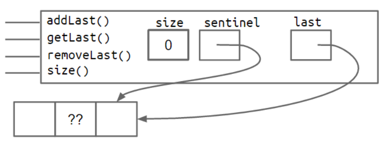
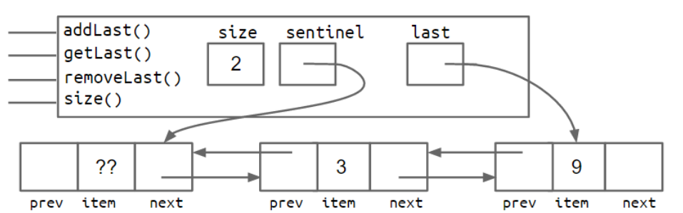
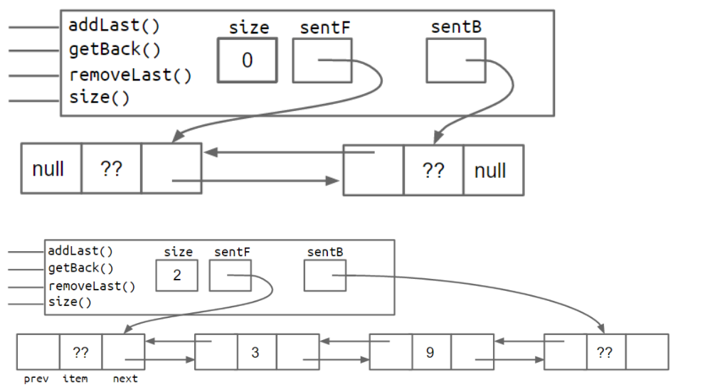
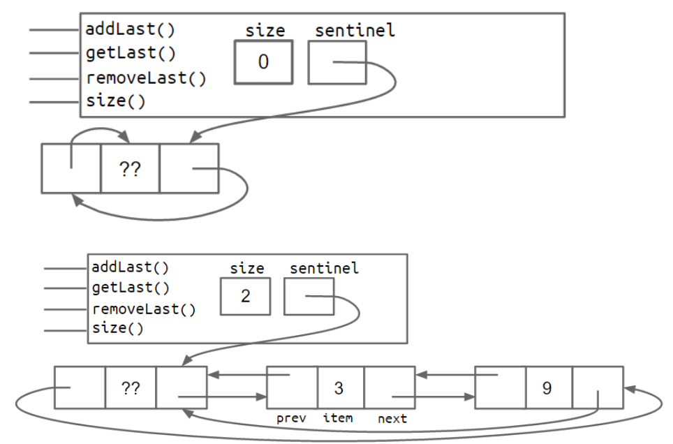
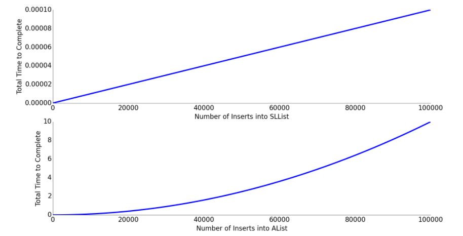

# 2 Lists

## 2.1 Mystery of the Walrus

### Bits

1. 考虑以下的声明

    ```java
    char c = 'H';
    int x = c;		// print x 会得到 72
    ```

    此时 `x` 和 `c` 都包含了相同的位。打印时，Java 解释器会根据它们的变量类型不同，作不同的处理方式。

    > Java 中的 8 种 primitive types: byte, short, int, long, float, double, boolean, char.
    >
    > 其他的一切类型 (包括 arrays), 称为 **reference type**.

2. **Declarating a Variable (Simplified)** 当声明了

    ```java
    int x;
    double y;
    ```

    Java 将决定用计算机中的 32 bits 来存储 `x`，用 64 bits 来存储 `y` (Java 中无法访问具体的地址，unlike C).

    - **Golden Rule of Equals (GRoE)** 当写 `b = a` 时，Java 解释器将 `a` 中的位复制到 `b`

### Reference Type

3. 考虑如下的 Class

    ```java
    public static class Walrus {
        public int weight;
        public double tuskSize;
        public Walrus(int w, double ts) {
            weight = w;
            tuskSize = ts;
        }
    }
    ```

    - 当使用 `new Walrus(1000, 8.3)` 时，则创造了一个 96 bits (实际会更大一些) 的 object

    

4. **Reference Variable Declaration**. 当声明了一个 reference type 的变量，如 `Walrus someWalrus;`，Java 将分配一个 64 bits 的 box 来存储其。

    - 这个 64 bits 的 box 用于存储 walrus object 的地址！

    - 考虑

        ```java
        Walrus some Walrus;					// 创建了一个 64 bits 的 box
        someWalrus = new Walrus(1000, 0.3);   // 创建了一个新的 Walrus, 其存储地址由 new 关键字返回 (返回一些位)
        // 根据 GRoE, 这些位被复制到了 someWalrus 的 box 中
        ```

    - 参考下图

    

    - 也可以把特殊值 `null` 赋给 reference type 变量。如 `someWalrus = null`. 则其位全变成 0.

5. **Box and Pointer Notation**. 

    - 如果地址全为 0，则用 null 来表示其。
    - 对于 non-zero，用指向对象的实例箭头表示。

    

### Parameter Passing

> argument: 实参 (actual parameter)。parameter: 形参 (formal parameter)

6. 在传递参数时，也只是复制了位 (GRoE 也适用于参数传递)。

    - 复制位常称为 "pass by value", 在 Java 中总是 pass by value,

    - 例 (观察下列 `walrus` 和 `x` 的变化)

        ```java
        public class PassByValueFigure {
            public static void main(String[] args) {
                Walrus walrus = new Walrus(3500, 10.5);
                int x = 5;
                doStuff(walrus, x);
                System.out.println(walrus);
                System.out.println(x);
            }
            public static void doStuff(Walrus w, int x) {
                w.weight -= 100;
                x -= 5;
            }
        }
        ```

### Instantiation of Arrays

7. 存储 array 的变量也是 reference variables (都使用 64 bits 存储)。考虑

    ```java
    int[] x;						// Instantiating an array x
    x = new int[]{0, 1, 2, 95, 4};	  // new 创建了 5 个 32 bit 的 box, 并返回整个 object 的地址给 x.
    ```

    - 丢失与地址对应的位，则很可能丢失对象。如让 `x = 0`.

### IntLists

8. 一个非常基本的 list 实现

    ```java
    public class IntList {
        public int first;
        public IntList rest;
        public IntList(int f, IntList r) {
            first = f;
            rest = r;
        }
    }
    ```

    - 考虑 make 一个三个数 5, 10, 15 的 list，可以

        ```java
        IntList L0 = new IntList(5, null);
        L0.rest = new IntList(10, null);
        L0.rest.rest = new IntList(15, null);
        ```

        也可以考虑从后往前构建 (此时有更简洁的代码)

        ```java
        IntList L = new IntList(15, null);
        L = new IntList(10, L);
        L = new IntList(5, L);
        ```

    - 可以考虑在 IntList class 中添加辅助 method 来执行基本任务 (面向对象的策略)

9. （size() and iterativeSize() methods）考虑在 IntList 中添加一个方法，可以返回 `L` 中的 items 数量

    - 可以使用递归的方法

        ```java
        public int size() {
            if (this.rest == null)
                return 1;
            return (this.rest.size() + 1);
        }
        ```

        - 不设置 `if (this == null) return 0;` 是因为当 `L` 为空时，调用 `L.size()` 则会受到 NullPointer 的 error.

    - 也可以不采用 recursion，而采用 loop

        ```java
        public int iterativeSize() {
            int count = 0;
            for (IntList iter = this; iter != null; iter = iter.rest)
                count++;
            return count;
        }
        ```

        - 注意应当引入一个变量 `iter`，而不能直接 `this.rest`

10. (get() methods) 考虑在 IntList 中添加一个方法，可以返回 `L` 中 i-th item 的值

    ```java
    public int iterativeGet(int i) {
        IntList p = this;
        while (i > 0) {
            p = p.rest;
            i--;
        }
        return p.first;
    }
    // 也可以采用递归
    public int get(int i) {
        if (i == 0)
            return first;
        return rest.get(i - 1);
    }
    ```


---

<br />

## 2.2 The SLList

> `IntList` -> **naked recursive** data structure. 因此构建一个新的 class `SLList`.

### Improvement #1: Rebranding

1. 考虑重命名为

    ```java
    public class IntNode {
        public int item;
        public IntNode next;
        public IntNode(int i, IntNode n) {
            item = i;
            next = n;
        }
    }
    ```

### Improvement #2: Bureaucracy

2. `IntNode` 很难使用，故创建一个单独的 class `SLList` 用于用户交互

    ```java
    public class SLList {
        public IntNode first;
        // constructor
        public SLList(int x) {
            first = new IntNode(x, null);
        }
    }
    ```

### addFirst and getFirst

3. 考虑给 `SLList` 添加两个 method

    ```java
    public void addFirst(int x) {
        first = new IntNode(x, first);
    }
    public int getFirst() {
        return first.item;
    }
    ```

    - `addFirst`: Adds an item to the front of the list
    - `getFirst`: Retrives the front item from the list

    例如要创建一个 5 -> 10 -> 15 -> null 的 list，则可以 (注释的内容是使用 IntList)

    ```java
    SLList L = new SLList(15);			// IntList L = new IntList(15, null);
    L.addFirst(10);					   // L = new IntList(10, L);
    L.addFirst(5);					   // L = new IntList(5, L);
    System.out.println(L.getFirst());	 // System.out.println(L.first);
    ```

### Improvement #3: Public vs. Private

4. 我们将 SLList 中的 `first` 声明为 `private`

    ```java
    public class SLList {
        private IntNode first;
        // ...
    }
    ```

    - private variables and methods can only be accessed by code inside the same .java file.
    - (SLList.java 中的任意代码都可以访问 `first`，其他 files 则不行)

### Improvement #4: Nested Class

5. 考虑将 `IntNode` 嵌入 `SLList` 中

    ```java
    public class SLList {
        // 此处声明为 static
        public static class IntNode {
            public int item;
            public IntNode next;
            public IntNode(int i, IntNode n) {
                item = i;
                next = n;
            }
        }
        // ...
    }
    ```

    - Java 中，可以将一个 class 嵌入到另一个 class 中

    - Having a nested class has no meaningful effect on code performance.

    - Nested classes 可分为 static and non-static 声明方式如下

        ```java
        class OuterClass {
            class InnerClass {
                // ...
            }
            static class StaticNestedClass {
                // ...
            }
            // ...
        }
        ```

    - 如果嵌套类不需要使用 OuterClass 的任何 instance methods 或者 variables, 则可以把其声明为 static
    - 将嵌套类声明为 static，则 methods inside the static class can not access any of the members of the enclosing class. (意味着 `IntNode` 中的任意 method 无法访问 `first`, `addFirst()`, `getFirst()`)

### addLast() and size()

6. 可以创建一个 `addLast()` 用于在尾部插入一个新的 node

    ```java
    public void addLast(int x) {
        IntNode iter = first;
        while (iter.next != null)
            iter = iter.next;
        iter.next = new IntNode(x, null);
    }
    ```

7. 可以创建一个 `size()` 用于返回 SLList 的 size

    - 可以先写一个针对 IntNode 的 `size()`，然后再写 SLList 的 `size()`

        ```java
        public static int size(IntNode p) {
            if (p.next == null)
                return 1;
            return (1 + size(p.next));
        }
        public int size() {
            return size(first);
        }	// 这里利用的是重载 (overload) 机制
        ```

    - 也可以利用 iteration

        ```java
        public int size() {
            int count = 0;
            for (IntNode iter = first; iter != null; iter = iter.next)
                count++;
            return count;
        }
        ```

### Improvement #5: Caching

8. 考虑添加一个变量 `size` 来跟踪当前 SLList 的 size. 这样，一些 method 有所改变

    ```java
    public class SLList {
        private IntNode first;
        private int size;
    
        public SLList(int x) {
            first = new IntNode(x, null);
            size = 1;	// 新增
        }
        public void addFirst(int x) {
            first = new IntNode(x, first);
            size++;		// 新增
        }
        public void addLast(int x) {
            IntNode iter = first;
            while (iter.next != null)
                iter = iter.next;
            iter.next = new IntNode(x, null);
            size++;		// 新增
        }
        public int size() {
            return size;
        }
        // ...
    }
    ```

### Improvement #6: The Empty List

9. 考虑实现一个空的 SLList. 首先添加一个 (重载) constructor

    ```java
    public SLList() {
        first = null;
        size = 0;
    }
    ```

    注意当 SLList 为空时， `addLast` 会出错 (因为不能访问 first.next). 可做如下修改

    ```java
    public void addLast(int x) {
        if (first == null) {
            first = new IntNode(x, null);
            return;			// 直接跳出此 method, 同 C
        }
        IntNode iter = first;
        while (iter.next != null)
            iter = iter.next;
        iter.next = new IntNode(x, null);
        size++;
    }
    ```

### Improvement #6b: Sentinel Nodes

10. 为了避免 `addLast()` 中要对特殊情况做处理 (`first == null`)。可以引入一个特殊的 node `sentinel` (sb结点)，将其置于 list 的开头，代替 `first`. 其中 `sentinel.item` 可以为任意值。

    - Class 的形状

    

    - 此时 `addLast()` 不需要 `if (first == null) ...`，但是需要修改一通 SLList Class

        ```java
        public class SLList {
            private IntNode sentinel;		// modified
            private int size;
        
            public SLList(int x) {
                sentinel = new IntNode(114154, null);   // 不妨 114514, modified
                sentinel.next = new IntNode(x, null);
                size = 1;
            }
            public SLList() {
                sentinel = new IntNode(114514, null);	// modified
                size = 0;
            }
            public void addFirst(int x) {
                sentinel.next = new IntNode(x, sentinel.next);  // 注意所有 node 都要在 sb 之后, modified
                size++;
            }
            public int getFirst() {
                return sentinel.next.item;	// modified
            }
            public void addLast(int x) {
                IntNode iter = sentinel;	// modified
                while (iter.next != null)
                    iter = iter.next;
                iter.next = new IntNode(x, null);
                size++;
            }
        	// ...
        }
        ```

### Invariants

11. 具有 sb 结点的 SLList, 具有以下的 invariants
    - `sentinel` 始终指向 sb 结点
    - 首元结点存在的话，一定是 `sentinel.next`
    - `size` is always the total number of items that have been added.

---

<br />

## 2.3 The DLList

### addLast

1. 考虑给 SLList 添加变量 `last` 来表示最后一个 node，于是 addLast 则不需要遍历整个 list

    ```java
    public void addLast(int x) {
        last.next = new IntNode(x, null);
        last = last.next;
        size++;
    }
    ```

    此时还要修改一下 constructor

    ```java
    public SLList(int x) {
        sentinel = new IntNode(114154, null);
        sentinel.next = new IntNode(x, null);
        size = 1;
        last = sentinel.next;	// 新增
    }
    public SLList() {
        sentinel = new IntNode(114514, null);
        size = 0;
        last = sentinel;		// 新增
    }
    ```

    > 添加 `last` 之后，`addLast()` and `getLast()` 很快，但是 `removeLast()` 仍然很慢
    >
    > - 注意添加 `secondToLast` 也无用 (因为当最后一项删除时，还需要找到倒数第三项)

### Improvement #7: Looking Back

2. 为了解决上面说的问题，考虑在每一个 `IntNode` 中添加一个向前的指针

    ```java
    public class IntNode {
        public IntNode prev;	// back pointer
        public int item;
        public IntNode next;
    }
    ```

    - 我们称由这样 node 组成的 list 为 **doubly linked list**. (没有 `prev` 的称为 **single linked list**)
    - size 为 0 的 DLList 的形状如下

    

    - size 为 2 的 DLList 的形状如下

    

### Improvement #8: Sentinel Upgrade

3. 引入上述 DLList 之后，编写某些 method 时需要处理一些特殊的情况. 所以考虑改进 sentinel.

    > 以 `addFirst()` 为例，若 DLList 不为空的的时候，需要在头部插入 `x` 则需要
    >
    > ```java
    > IntNode p = new IntNode(sentinel, x, sentinel.next);
    > sentinel.next.prev = p;		// 当 size 为 0 的时候, sentinel.next == null, 则运行错误
    > sentinel.next = p;
    > ```

    - 一种该改进方法是添加第二个 sb，放在末尾。形状如图

    

    - 另一种方法是成环，with the front and back pointers sharing the same sentinel node。形状如下

    

### Generic DLList

4. 考虑将我们的 list 泛型化，只要在类声明中的 class 名之后添加 `<>` 即可

    ```java
    public class GenericSLList<ListType> {
        // 注意 node 不能声明为 static, 不然无法使用 ListType
        public class StuffNode {
            public ListType item;
            public StuffNode next;
            public StuffNode(ListType i, StuffNode n) {
                item = i;
                next = n;
            }
        }
    
        private StuffNode sentinel;
        private int size;
        private StuffNode last;
    
        public GenericSLList(ListType x) {
            sentinel = new StuffNode(x, null);          // 不妨把 x 丢到 sentinel 中
            sentinel.next = new StuffNode(x, null);
            size = 1;
            last = sentinel.next;
        }
        public GenericSLList() {
            sentinel = new StuffNode(null, null);   // 不妨把 null 丢到 sentinel 中
            last = sentinel;
        }
        public void addFirst(ListType x) {
            sentinel.next = new StuffNode(x, sentinel.next);    // 注意所有 node 都要在 sb 之后
            size++;
        }
        public ListType getFirst() {
            return sentinel.next.item;
        }
        public void addLast(ListType x) {
            last.next = new StuffNode(x, null);
            last = last.next;
            size++;
        }
        public int size() {
            return size;
        }
    }
    ```

    - Instantiate the class。示例如下

        ```java
        GenericSLList<String> d = new GenericSLList<>("hello");		// 右边的 <> 内写入 String 也没问题
        d.addLast("world");
        ```

    - 注意泛型 (generic) 仅适用于 refence type. 要使用基本类型的时候, we use the reference version of the primitive type。示例

        ```java
        GenericSLList<Integer> d1 = new GenericSLList<>();
        d1.addLast(10);
        ```

    - rules of thumb (经验法则)
        - In the .java file **implementing** a data structure, specify your generic type name only once at the very top of the file after the class name.
        - In other .java files, which use your data structure, specify the specific desired type during declaration, and use the empty diamond operator during instantiation.
        - If you need to instantiate a generic over a primitive type, use `Integer`, `Double`, `Character`, `Boolean`, `Long`, `Short`, `Byte`, or `Float` instead of their primitive equivalents.

---

<br />

## 2.4 Arrays

### Arraay Basics

1. Arrays consist of

    - A fixed integer length $N$.
    - A sequcence of $N$ memory boxes where all boxes are of the same type, and are numbered $0$ through $(N - 1)$

    (Unlike classes, arrays do not have methods)

### Array Creation

2. 数组创建的 3 种有效的表示方法

    ```java
    x = new int[3];					// 采用默认值 0 来填充这个 box
    y = new int[]{1, 2, 3, 4, 5};
    int z = {9, 10, 11, 12, 13};	 // 同时声明和创建数组 (只能在此情况下使用), 省略了 new
    ```

### Array Access and Modificatoin

3. System method `arraycopy()` 用于将信息从一个数组复制到另一个数组. 其接受 5 参数

    - The array to use as a source
    - Where to start in the source array
    - The array to use as a destination
    - Where to start in the destination array
    - How many items to copy

    使用示例

    ```java
    int[] x = new int[]{-1, 2, 5, 4, 99};
    int[] b = {9, 10, 11};
    System.arraycopy(b, 0, x, 3, 2);	// x 便乘 [-1, 2, 5, 9, 10]
    ```

    - `arraycopy()` 通常比循环赋值更快

### 2D Arrays in Java

4. 示例

    ```java
    int[][] pascalsTriangle;
    pascalsTriangle = new int[4][];
    int[] rowZero = pascalsTriangle[0];
    
    pascalsTriangle[0] = new int[]{1};
    pascalsTriangle[1] = new int[]{1, 1};
    pascalsTriangle[2] = new int[]{1, 2, 1};
    pascalsTriangle[3] = new int[]{1, 3, 3, 1};
    int[] rowTwo = pascalsTriangle[2];
    rowTwo[1] = -5;
    
    int[][] matrix;
    matrix = new int[4][];
    matrix = new int[4][4];
    
    int[][] pascalAgain = new int[][]{
            {1}, {1, 1}, {1, 2, 1}, {1, 3, 3, 1}
    };
    ```

---

<br />

## 2.5 The AList

### First Attempt: The Naive Array Based List

1. 写一个 Alist. 

    ```java
    public class AList {
        private int size;
        private int[] items;
    
        public AList() {
            size = 0;
            items = new int[100];
        }
        public void addLast(int x) {
            items[size] = x;
            size++;
        }
        public int getLast() {
            return items[size - 1];
        }
        public int get(int i) {
            return items[i];
        }
        public int size() {
            return size;
        }
    }
    ```

### removeLast

2. 给 AList 写一个 method, 返回最后一项的值，并删除其

    ```java
    public int removeLast() {
        int last = getLast();
        size--;			// 只需要 size-- 即可删除
        return last;
    }
    ```

### Naive Resizing Arrays

3. 在 `addLast` 时，如果 size 超出了 constructor 所分配的 `items` 的大小，则需要扩展 `items`

    ```java
    public void addLast(int x) {
        if (size == items.length) {
            int a[] = new int[size + 1];			// 造出一个更大的 array
            System.arraycopy(items, 0, a, 0, size);  // 将原来的数组拷贝被新的数组
            items = a;							   // 丢掉原来的数组, 让 items 指向新的数组
        }
        items[size] = x;
        size++;
    }
    ```

### Analyzing the Naive Resizing Array

4. 考虑 `addLast()` 执行 $N$ 次 ($N \gg 1$)。SLList 需要的时间正比于 $N$，然而 AList 所需的时间近似正比于 $N^2$

    

    显然平方正比是不可接受的。

### Geometric Resizing

5. 为了解决上述问题，可以考虑 resize 的时候不加 1，而是加一个 `RFACTOR`，速度可以得到提升

    ```java
    public void addLast(int x) {
        if (size == items.length)
            resize(size + 1);
        items[size] = x;
        size++;
    }
    ```

    但是这还是不行，不如乘一个 `RFACTOR`

### Memory Performance

6. 考虑某时我们删除了大量的元素，即利用率 R (`size / items.length`) 很小，则可以缩短 length
    - In a typical implementation, we halve the size of the array when R fails to less than 0.25.

### Generic ALists

7. 考虑泛型化。但需要注意 Java 不允许我们创建泛型对象的 array.

    ```java
    TypeName[] items = new TypeName[8];		// error!
    ```

    可以使用以下的句法

    ```java
    TypeName[] items = (TypeName []) new Object[8];		// 会报警, 但是先不管
    ```

8. 我们还需要做另一个更改：Null out any items that we "delete".

