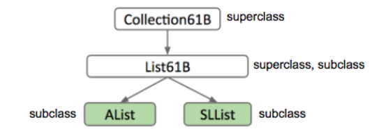

# 4 Inheritance, Implements

## 4.1 Intro and Interfaces

### Hypernyms, Hyponyms, Interface Inheritance

1. **(terms)** 考虑前面的 AList 和 SLList，我们有如下的关系

    

    - 称 AList and SLList 是 List61B 的 **hyponym** 以及 **subclass**
    - 称 List61B 是 Alist and SLList 的 **hypernym** 以及 **superclass**
    - 新的 List61B 称为 **Interface**，其本质上指定了 list 必须能够做的事

2. Java 中如果要表达上述的层次结构，则需要

    - Step 1: Define a type for the general list hypernym

        ```java
        public interface List61B<Item> {
            public void addFirst(Item x);
            public void addLast(Item y);
            public Item getFirst();
            public Item getLast();
            public Item removeLast();
            public Item get(int i);
            public void insert(Item x, Item position);
            public int size();
        }
        ```

    - Step 2: Specify that SLList and AList are hyponyms of that type.

        ```java
        // 修改 AList 和 SLList 的类 sign
        public class AList<TypeName> implements List61B<TypeName> {...}
        public class SLList<ListType> implements List61B<ListType> {...}
        ```

        

        

